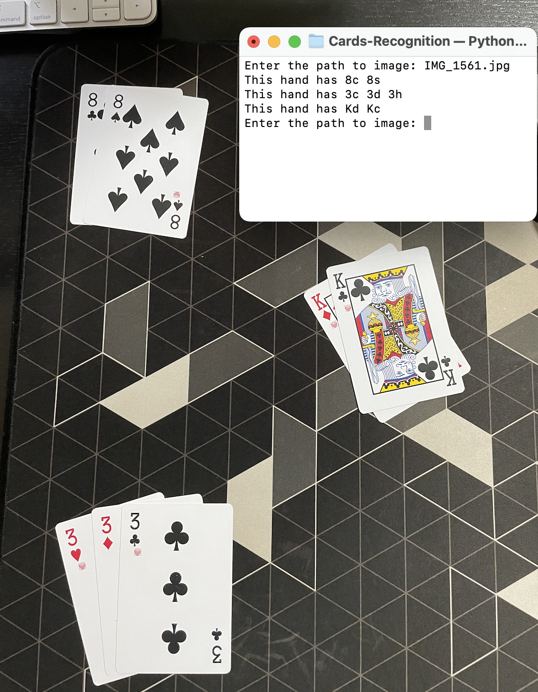

<p align="center">

  <h3 align="center">Cards Recognition</h3>

  <p align="center">
    Applications built with Cards Recognition using YOLOv5
  </p>
</p>

<!-- TABLE OF CONTENTS -->
<details open="open">
  <summary><h2 style="display: inline-block">Table of Contents</h2></summary>
  <ol>
    <li>
      <a href="#getting-started">Getting Started</a>
      <ul>
        <li><a href="#prerequisites">Prerequisites</a></li>
        <li><a href="#installation">Installation</a></li>
      </ul>
    </li>
    <li><a href="#usage">Usage</a></li>
    <li><a href="#usage">Features</a></li>
  </ol>
</details>

<!-- GETTING STARTED -->

## Getting Started

To get a local copy up and running follow these simple steps.

### Prerequisites

- python3
- pip

### Installation

1. Clone the repo
   ```sh
   git clone https://github.com/pholawat-tle/Cards-Recognition
   cd Cards-Recognition
   ```
2. Clone YOLOv5
   ```sh
   git clone https://github.com/ultralytics/yolov5
   ```
3. Install YOLOv5 Dependencies

   ```sh
   pip install -r yolov5/requirements.txt
   ```

4. Copy the trained weights to the project directory

<!-- USAGE EXAMPLES -->

## Usage

To run the application on webcam, run the command `python webcam.py` inside terminal.

## Features

### Hand Detection <sub><sup>\*</sup></sub>

The application can seperate cards detected into small hands using the distance between the bounding box of each card.

_The position and angle of the camera has a huge influence on the accuracy of this feature._

<sub><sup>\*Only in image.py</sup></sub>
